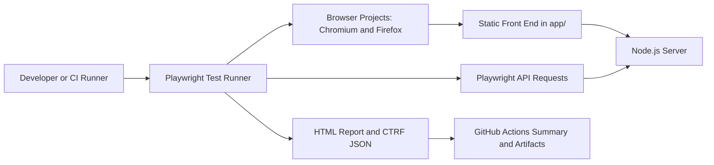

# Portfolio
- [About me](#about-me)
- [CV](#cv)
- [Skills](#skills)
- [Tools](#tools)
- [Courses](#courses)
- [Examples of my work](#examples-of-my-work)
  * [Test cases and work in TestRail](#test-cases-and-work-in-testrail)
  * [Bug reports and work in Jira](#bug-reports-and-work-in-jira)
  
## About me

     

Skill:

Testing Artifacts
Manual Testing
Automation Testing (Postman)
Agile Test Planning & Testing
System Testing and Testing Lifecycle
Regression and Functional Testing
UI & Compatibility Testing
Data Interface & Migration Testing
Performance/Load/Stress Testing
Testing Automation
Defect/Bug Tracking
Using Katalon, Selenium, APache JMeter
CV
You can download my CV as a PDF from my Google Drive.

Skills
You can find examples of the described skills in the Examples of my work section.

Manual testing

can perform manual functional and usability testing of web applications
gained hands-on experience by testing applications created for educational purposes
Test analysis & design

familiar with functional decomposition of products, creating state transition diagrams, writing use cases
can apply equivalence partitioning, boundary value analysis and methods of pairwise testing to generate test input data
API testing

know the difference between SOAP and REST APIs
gained experience through manual testing of APIs created for educational purposes
know how to manipulate requests and create test cases using the SoapUI tool
Exploratory testing

capable of using Whittaker’s test tours and creating cheat-lists for testing web applications
Test documentation

can create test cases and checklists and know how and in which situations to use them effectively
able to prepare comprehensive bug reports and provide detailed session reports
SQL databases

can write complex requests using subqueries
familiar with the use of aliases and wildcards
know the difference between joins and unions and can use them in queries
Python fundamentals

can write simple functions and algorithms
know when to use for and while
able to comprehend easy codes
Tools
TestRail

know how to create test cases and test suits
able to run created test cases
know how to use dashboards and statistics
Katalon

Automate web applications using Katalon Studio
Create web ui tests for multiple browsers
Learn record and playback
Find objects using object spy
Execute web ui automation tests on multiple browsers
Results and Reporting
Send Email notification with results
Integrate with Jenkins for Continuous Integration
Integrate with Git (Version Control System)
Work with Katalon Studio for personal and enterprise projects
Selenium

Create automation frameworks using Selenium in Java
Understand the basic and advanced concepts and working of Selenium
Understand the basic and advanced concepts of Automation Frameworks
create test automation framework step by step
Apache Jmeter

Data driven Testing from external file
Importance of Correlation
Usage of Correlation on Dynamic values
Http cookie Manager and Link Parser
Beanshell Scripting Introduction
Jmeter Scripting with Beanshelll Language
Integration of Selenium Testcases with Jmeter
REST API overview and usage Load Testing on REST API's
Postman

Understand Rest API Automation with Postman
Assertions in Postman
Collection Test Runner in Postman
Validating Json responses
Json Schema validations in Postman
Data Driven testing with Postman
 Work flow execution methods in Postman
Parsing complex Json responses with Pm object
 Jira
know how to create bug reports
able to create projects and track their progress

 
 
 
 
 # Playwright Automation Framework Portfolio

[](https://github.com/Nick-25/playwright-automation-framework/actions/workflows/playwright.yml)
[](https://playwright.dev/)
[](https://www.typescriptlang.org/)
[](https://nodejs.org/)
[](LICENSE)

## Executive Summary

Playwright Automation Framework Portfolio is a production-style framework that demonstrates how modern QA automation can be designed, executed, reported, and maintained across UI and API layers.

It pairs a realistic local application with layered Playwright coverage, CI reporting, and maintainable test architecture. It is structured to show senior-level automation practices rather than isolated test snippets.

## Key Capabilities

- UI and API automation coverage across browser workflows, authentication, authorization, task management, user management, pagination, and negative paths
- 48 Playwright test cases executed across Chromium and Firefox browser projects
- Chromium and Firefox browser execution through Playwright projects
- Accessibility smoke testing with `@axe-core/playwright`
- Visual regression smoke testing with Chromium screenshot baselines
- GitHub Actions CI/CD integration with build, test, artifact upload, and report publishing jobs
- Playwright HTML and CTRF JSON reporting
- Docker and Docker Compose execution support
- Local application under test with Node.js, static front end, JWT sessions, protected routes, and SQLite persistence
- Maintainable test architecture using Page Object Model classes, fixtures, and shared API/auth helpers

## Screenshots

These are real captures from the framework, grouped to show the app experience, CI execution, and generated test evidence.
| --- | --- |
| Application | Automation Evidence |

| <br>**Login Page** | <br>**GitHub Actions Run** |
| <br>**Dashboard** | <br>**Playwright HTML Report** |
|  | <br>**Accessibility Test** |

## Why This Project Exists

This project exists to demonstrate production-style Playwright architecture in a compact, reviewable portfolio codebase.

- Showcase UI, API, accessibility, visual, and CI testing in one coherent framework
- Provide a realistic automation portfolio project with a live local application under test
- Demonstrate maintainable automation patterns such as page objects, fixtures, API helpers, seeded data, and durable cleanup
- Model how an automation framework can create useful feedback for engineers, hiring managers, and consulting clients

## How to Review This Project

- **Recruiters:** Start with Key Capabilities, Screenshots, and Business Value for a quick view of the portfolio scope.
- **Hiring managers:** Review What This Demonstrates, Consulting Relevance, Architecture Diagram, and Lessons Learned to evaluate test strategy and maintainability.
- **Engineers:** Inspect `tests/`, `playwright.config.ts`, `server.js`, and the docs links for implementation depth.
- **Consulting clients:** Focus on CI/CD and Reporting, Docker Execution, and the reference docs to see how the framework supports repeatable delivery workflows.

## Overview

This project provides a controlled application under test and a full-stack Playwright automation framework around it. The app includes authentication, protected routes, dashboard metrics, profile data, task management workflows, role-based API behavior, and persistent local data.


## What This Demonstrates

- Layered browser and API automation with Playwright Test
- Page Object Model design for maintainable UI workflows
- Authentication and authorization coverage across cookies, JWTs, local browser state, user roles, and admin-only behavior
- Workflow coverage for login, dashboard metrics, profiles, task management, pagination, validation, and negative paths
- Accessibility and visual smoke testing with `@axe-core/playwright` and Playwright screenshot assertions
- Cross-browser execution with Chromium and Firefox plus Playwright `webServer` orchestration
- SQLite-backed local data with seeded records and durable cleanup helpers
- GitHub Actions CI with Playwright HTML reports, CTRF JON, artifacts, and scoped workflow permissions
- Repository hygiene through CODEOWNERS, PR templates, Dependabot, and contribution/security guidance

## Business Value

This framework shows how an automation solution can reduce release risk, improve regression confidence, and create actionable feedback for engineering teams.

- Validates critical user journeys and service behavior across UI and API layers
- Catches authorization and data-scope defects earlier in the delivery cycle
- Produces CI artifacts and reports that support fast triage
- Uses maintainable abstractions so coverage can grow without unnecessary maintenance cost
- Supports repeatable automated validation with controlled local application state

## Consulting Relevance

The project maps to common QA automation consulting and modernization needs.

- **Selenium to Playwright migrations:** Shows fixtures, auto-waiting, traces, parallel execution, and multi-browser projects as a modernization path.
- **Playwright implementation:** Provides a reusable baseline with page objects, fixtures, API helpers, test data patterns, and local app orchestration.
- **CI/CD integration:** Runs build, test, artifact upload, and report publishing through GitHub Actions.
- **API automation:** Validates authentication, authorization, user management, task workflows, pagination, validation, and negative paths.
- **Accessibility testing:** Adds axe-powered smoke coverage and UI validation checks for public and authenticated pages.
- **Framework modernization:** Demonstrates a layered strategy across UI, API, accessibility, visual checks, reporting, and CI.

## Architecture Diagram



Detailed architecture notes are available in [`docs/architecture.md`](docs/architecture.md), including the application layer, page objects, tests, fixtures, utilities, CI/CD, and reporting strategy.

## Project Structure

```text
.
|-- app/                         Static front end for the application under test
|-- docs/                        Supplemental project and application documentation
|   |-- api-reference.md         API endpoints and authentication details
|   |-- application-overview.md  Application behavior and test coverage overview
|   |-- architecture.md          Framework architecture and maintainability notes
|   |-- postman-usage.md         Manual API exploration with Postman
|   `-- images/                  Real screenshot captures
|-- scripts/                     Supporting project scripts
|-- tests/
|   |-- fixtures/                Shared Playwright fixtures and seeded users
|   |-- helpers/                 Authentication and test support helpers
|   |-- pages/                   Page Object Model classes
|   |-- *.spec.ts                Browser and API test specifications
|   `-- README.md                Test-suite usage notes
|-- .github/
|   |-- workflows/playwright.yml CI pipeline for build, test, and reporting
|   |-- CODEOWNERS               Repository ownership
|   `-- dependabot.yml           Dependency update configuration
|-- playwright.config.ts         Playwright projects, reporters, and webServer setup
|-- server.js                    Local Node.js application and API server
|-- postman_collection.json      API collection for manual API exploration
|-- package.json                 Node scripts and dependencies
|-- LICENSE                      MIT license
`-- README.md                    Portfolio and framework overview
```

## Technology Stack

| Area | Technology |
| --- | --- |
| Test runner | Playwright Test |
| Language | TypeScript |
| Runtime | Node.js |
 | Visual testing | Playwright screenshot assertions |
| Application server | Node.js HTTP server |
 | Browser coverage | Chromium and Firefox |
| Test design | Page Object Model, fixtures, API helpers |
| Reporting | Playwright HTML report, CTRF JSON, GitHub Actions summary |
| CI/CD | GitHub Actions |
| API exploration | Postman collection |

## CI/CD and Reporting

The GitHub Actions workflow runs on pushes and pull requests to `master`.

1. `Build App` installs dependencies and runs `npm run build --if-present`.
2. `Run Playwright Tests` installs Playwright browsers, executes `npm test`, and uploads artifacts.
3. `Publish Test Report` downloads the CTRF artifact and publishes the test report into the GitHub Actions summary.

The framework produces multiple reporting outputs:

- Playwright HTML report for local investigation, trace review, and test-level debugging
- `test-results/` artifacts for traces, screenshots, videos, and attachments when generated
- `ctrf/ctrf-report.json` for standardized machine-readable reporting
- GitHub Actions summary output through `ctrf-io/github-test-reporter`

## Lessons Learned

- **Framework maintainability:** Page objects, fixtures, and focused smoke specs keep selectors, setup, and repeated user actions out of specs, making the suite easier to extend as workflows change.
- **Flaky test reduction:** Playwright auto-waiting, API-driven setup, stable seeded users, and targeted cleanup reduce timing sensitivity and state leakage.
- **Reporting strategy:** Pairing Playwright HTML reports with CTRF JSON and GitHub Actions summaries gives both engineers and stakeholders useful views of the same execution.
- **Test organization:** Splitting UI workflows, API coverage, fixtures, helpers, and page objects keeps the framework readable while still demonstrating full-stack validation.

## Local Execution

```powershell
nvm use
npm install
npx playwright install
npm test
```
 
  
## Future Enhancements

- Expand accessibility coverage beyond smoke checks with keyboard-navigation scenarios
- Expand visual regression coverage beyond smoke baselines for key workflow states
- Add mobile viewport projects for responsive validation
- Introduce test data factories for larger API and UI scenarios
- Add contract-style validation for API response schemas
- Publish test trend data across CI runs


**Performance & Scalability Testing — JMeter
**
As part of my QA Lead role at [GHX Healthcare / Innomaint — pick the real project], I used Apache JMeter to validate application performance under concurrent user load.

Built JMeter test plans for critical flows such as [login, document upload, search — pick real ones]
Configured Thread Groups to simulate [X] concurrent users, running Load and Stress test scenarios
Measured response time, throughput (TPS), and error rate using JMeter's Aggregate Report and Summary Report listeners
Identified a performance bottleneck at approximately [X] concurrent users, traced to [DB connection pool / server memory / API timeout]
Worked with the development team to resolve it; response time improved from [X]s to [Y]s after the fix
Findings were used as part of release sign-off criteria before go-live
